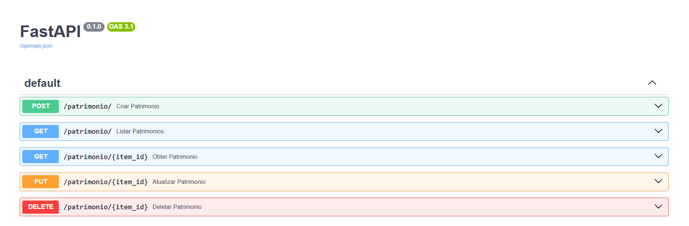
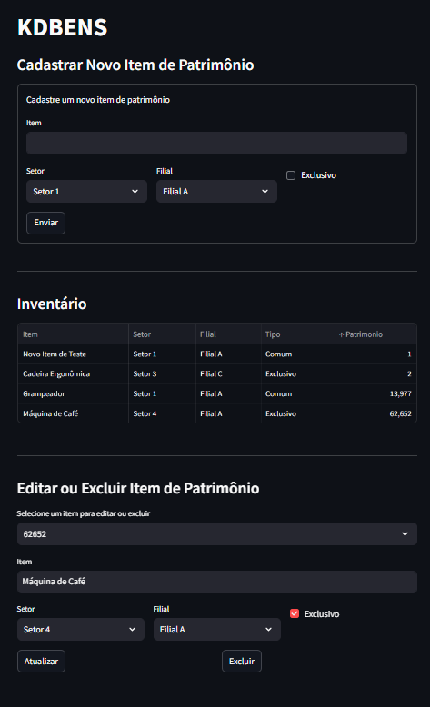
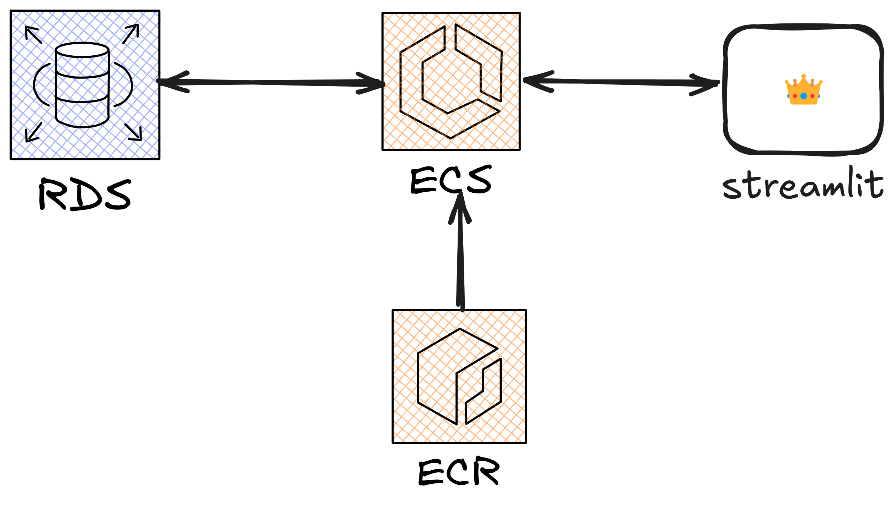

## Apresentação

Este repositório contém uma aplicação de exemplo para o gerenciamento e cadastro de itens patrimoniais. A arquitetura é dividida em duas partes principais: um backend desenvolvido com FastAPI e um frontend construído com Streamlit.

# Estrutura do Repositório

- **api/**: Contém o código do backend, construído com FastAPI, que fornece uma API RESTful para o gerenciamento dos itens patrimoniais. A API se conecta a um banco de dados PostgreSQL para armazenar as informações dos itens, como nome, descrição, categoria, e outros dados relevantes.

- **streamlit/**: Contém o código do frontend, desenvolvido com Streamlit. Esta aplicação fornece uma interface simples para os usuários cadastrarem e visualizarem os itens patrimoniais. O frontend consome a API fornecida pela pasta "api" para realizar operações como cadastro, listagem e edição de itens.

# Tecnologias Utilizadas:
- Backend: FastAPI, PostgreSQL
- Frontend: Streamlit
- Banco de Dados: PostgreSQL

## Postgres

O presente projeto foi construído baseado em serviços docker, incluindo o Postgres. Para iniciar uma instância do PostgreSQL com Docker, você pode seguir os seguintes passos:

### Certifique-se de ter o Docker instalado

Se você ainda não tem o Docker instalado, faça o download e siga as instruções no site oficial: [Docker Install](https://docs.docker.com/get-docker/).

### Baixe a imagem oficial do PostgreSQL

Use o comando abaixo para baixar a imagem oficial do PostgreSQL do Docker Hub:
```bash
docker pull postgres
```

### Inicie um contêiner do PostgreSQL

Execute o comando abaixo para iniciar um contêiner do PostgreSQL com as configurações básicas. Substitua `<nome_do_container>` e `<senha_root>` conforme desejado:

```bash
docker run --name <nome_do_container> -e POSTGRES_PASSWORD=<senha_root> -p 5432:5432 -d postgres
```

### Verifique se o contêiner está em execução

Após o comando acima, o PostgreSQL deve estar rodando. Você pode verificar o status do contêiner com:

```bash
docker ps
```

Esse comando irá listar todos os contêineres em execução. Você deverá ver o contêiner do PostgreSQL com o nome e a porta mapeada.

### Conectando ao PostgreSQL

Agora, você pode se conectar ao PostgreSQL utilizando um cliente de sua escolha (por exemplo, **pgAdmin**, **DBeaver**, ou linha de comando). Utilize as seguintes credenciais para se conectar:

- **Host**: `localhost`
- **Porta**: `5432`
- **Usuário**: `postgres`
- **Senha**: `<senha_root>` (a senha definida no comando `docker run`)

---

## Fastapi



Na pasta `api`, existe um arquivo `Dockerfile`, que descreve os passos para construir a imagem Docker para a aplicação. Para construir a imagem, siga os seguintes passos:

#### I. **Abra o terminal na pasta `api`**:
   Navegue até a pasta onde o `Dockerfile` está localizado. Supondo que você esteja no diretório raiz do projeto, basta ir para a pasta `api` com o comando:
   ```bash
   cd api
   ```

#### II. **Build da Imagem Docker**:
   Agora, execute o comando `docker build` para criar a imagem. A flag `-t` permite que você defina um nome para a imagem. Exemplo:
   ```bash
   docker build -t nome_da_imagem .
   ```

   O ponto `.` no final do comando indica que o Docker deve construir a imagem a partir do diretório atual (onde está o `Dockerfile`).

   Durante o processo de build, o Docker seguirá os seguintes passos:
   - Usará a imagem base `python:3.7.8-slim`.
   - Atualizará o `pip`.
   - Copiará o arquivo `requirements.txt` para o diretório `/app` no contêiner.
   - Instalará as dependências listadas no `requirements.txt`.
   - Copiará todos os arquivos do diretório local para o diretório `/app` no contêiner.
   - Definirá o diretório de trabalho como `/app`.
   - Expõe a porta 8080 e configurará o comando de entrada para rodar o Streamlit.

#### III. **Verificando a Imagem Criada**:
   Após o build ser concluído, você pode verificar a imagem gerada com o comando:
   ```bash
   docker images
   ```

   Isso mostrará todas as imagens Docker disponíveis, incluindo a que você acabou de criar.

### Configuração do Arquivo `.env`

O arquivo `.env-example` fornecido na pasta `api` contém variáveis de ambiente que são usadas pela API para se conectar ao banco de dados PostgreSQL. Você deve renomear esse arquivo para `.env` e preencher as informações corretas do banco de dados PostgreSQL.

Abra o arquivo `.env` com um editor de texto de sua preferência e preencha as variáveis com os valores do seu banco de dados PostgreSQL. As variáveis são:

- `DB_USER`: O nome de usuário do banco de dados (por exemplo, `postgres`).
- `DB_PASS`: A senha do usuário do banco de dados.
- `DB_NAME`: O nome do banco de dados onde a API irá armazenar os dados.
- `DB_HOST`: O endereço do servidor PostgreSQL. Caso esteja rodando localmente, pode usar `localhost`.
- `DB_PORT`: A porta onde o PostgreSQL está ouvindo, geralmente `5432`.

Exemplo do arquivo `.env` preenchido:

   ```
   DB_USER=postgres
   DB_PASS=minhasenha
   DB_NAME=meubanco
   DB_HOST=localhost
   DB_PORT=5432
   ```

A API irá ler essas variáveis de ambiente para se conectar ao banco de dados PostgreSQL. Certifique-se de que o arquivo `.env` esteja presente na pasta `api` ao rodar a aplicação.

### Rodando o Contêiner Docker

Após construir a imagem e configurar o arquivo `.env`, você pode rodar o contêiner Docker com o seguinte comando:

```bash
docker run --name nome_do_container -p 8000:8000 -d nome_da_imagem
```

Agora, a API deve estar funcionando e acessível na porta `8000` da sua máquina local.


## Streamlit



Dentro da pasta `streamlit`, existe um arquivo `Dockerfile` que define o processo de construção da imagem Docker para a aplicação frontend construída com **Streamlit**. Para construir a imagem, siga os passos abaixo:

#### I. **Abra o terminal na pasta `streamlit`**:
   Navegue até a pasta onde o `Dockerfile` está localizado. Supondo que você esteja no diretório raiz do projeto, basta ir para a pasta `streamlit` com o comando:
   ```bash
   cd streamlit
   ```

#### II. **Build da Imagem Docker**:
Execute o comando `docker build` para criar a imagem. Você pode escolher um nome para a imagem usando a flag `-t`:

```bash
docker build -t nome_da_imagem .
```

O ponto `.` no final indica que o Docker deve construir a imagem a partir do diretório atual onde o `Dockerfile` está localizado.

Durante o processo de build, o Docker seguirá os seguintes passos:
- Usará a imagem base `python:3.7.8-slim`.
- Atualizará o `pip`.
- Copiará o arquivo `requirements.txt` para o diretório `/app` no contêiner.
- Instalando as dependências listadas no `requirements.txt`.
- Copiará todos os arquivos do diretório local para o diretório `/app` no contêiner.
- Definirá o diretório de trabalho como `/app`.
- Expõe a porta 8080 e configurará o comando de entrada para rodar a aplicação Streamlit.

#### III. **Verifique a Imagem Criada**:
   Após o build ser concluído, você pode verificar a imagem gerada com o comando:
   ```bash
   docker images
   ```

   Isso listará todas as imagens Docker disponíveis, incluindo a que você acabou de criar.

### Configuração do Arquivo `.env`

O arquivo `.env-example` na pasta `streamlit` contém uma variável de ambiente chamada `API_URL`, que deve ser preenchida com a URL do backend da API (que está rodando no contêiner da pasta `api`).

Abra o arquivo `.env` com um editor de texto de sua preferência e preencha a variável `API_URL` com o caminho correto para a API que você configurou. Por exemplo, se a API estiver rodando localmente e mapeada na porta 8080, você pode configurá-la assim:

```
API_URL=http://localhost:8080
```

Caso a API esteja rodando em um servidor remoto ou em um contêiner Docker, você deve fornecer o IP ou domínio adequado.

### Rodando o Contêiner Docker para o Frontend

Após construir a imagem Docker e configurar o arquivo `.env`, você pode rodar o contêiner Docker para o frontend Streamlit com o seguinte comando:

```bash
docker run --name nome_do_container -p 8080:8080 -d nome_da_imagem
```

### Acessando o Frontend

Depois de rodar o contêiner, a aplicação Streamlit estará disponível na URL `http://localhost:8080` (ou na URL que você configurou na variável `API_URL`). Você pode acessar a interface gráfica do cadastro de itens patrimoniais através do navegador.

## Solução baseada em AWS



### Infraestrutura AWS para Aplicação com API Backend

Para implementar uma aplicação que usa **PostgreSQL** no backend e uma **API** contêinerizada, você pode montar a seguinte infraestrutura usando os serviços da AWS:

#### **Amazon RDS (Relational Database Service)**:
   - O **Amazon RDS** é um serviço gerenciado que facilita a configuração, operação e escalabilidade de bancos de dados relacionais na AWS.
   - Nesse caso, você pode usar o RDS para **instanciar uma instância do PostgreSQL** de maneira fácil e gerenciada.
   - O RDS cuida de tarefas administrativas como backups automáticos, patching de segurança e escalabilidade.
   - Você pode configurar uma instância do RDS com o PostgreSQL para armazenar e gerenciar os dados da sua aplicação, como os itens patrimoniais, usuários, entre outros.

#### **Amazon ECR (Elastic Container Registry)**:
   - O **Amazon ECR** é um serviço de registro de imagens Docker gerenciado pela AWS, onde você pode armazenar e gerenciar imagens de contêineres Docker.
   - Após construir a imagem Docker da sua aplicação (API), você pode fazer o upload dessa imagem para o ECR.
   - O ECR permite versionamento de imagens e facilita a integração com outros serviços da AWS, como o ECS, para executar contêineres.
   - Essa etapa é importante para ter uma imagem da API pronta para ser consumida em um ambiente de produção.

#### **Amazon ECS (Elastic Container Service)**:
   - O **Amazon ECS** é um serviço gerenciado de orquestração de contêineres Docker. Ele permite que você execute e gerencie contêineres de maneira escalável e segura.
   - Com o **ECS**, você pode rodar a API que está em um contêiner Docker, hospedado no ECR, de forma simples e com alta disponibilidade.
   - O ECS integra-se facilmente com outros serviços da AWS, como o **Elastic Load Balancer (ELB)** para balanceamento de carga, e **Amazon VPC** para segurança de rede.
   - Você pode configurar um **cluster ECS** para gerenciar as instâncias de contêineres que executarão a API. O ECS pode automaticamente ajustar o número de instâncias conforme a demanda de tráfego, garantindo alta disponibilidade e escalabilidade.

---

### Fluxo de Trabalho:

#### **Configuração do Banco de Dados**:
   - Crie uma instância no **Amazon RDS** para PostgreSQL e configure as credenciais de acesso.
   - O banco de dados RDS será acessado pela API que estará rodando no ECS.

#### **Construção e Upload da Imagem Docker**:
   - Crie a imagem Docker da API e envie essa imagem para o **Amazon ECR**.
   - O ECR servirá como repositório centralizado de imagens de contêineres.

#### **Orquestração de Contêineres**:
   - Use o **Amazon ECS** para rodar a API a partir da imagem Docker armazenada no ECR.
   - Configure os serviços ECS para garantir que a API esteja disponível, escalável e com alta disponibilidade.

#### **Acesso e Segurança**:
   - Utilize o **Elastic Load Balancer (ELB)** para distribuir o tráfego entre as instâncias da API no ECS.
   - A comunicação entre o **ECS** e o **RDS** será realizada de forma segura através de VPCs e grupos de segurança da AWS.

---

Essa infraestrutura permite que você tenha uma solução altamente disponível, escalável e gerenciada, onde o banco de dados PostgreSQL fica sob o gerenciamento do RDS, enquanto a API contêinerizada é executada de forma eficiente e escalável no ECS, com as imagens Docker sendo armazenadas no ECR.
